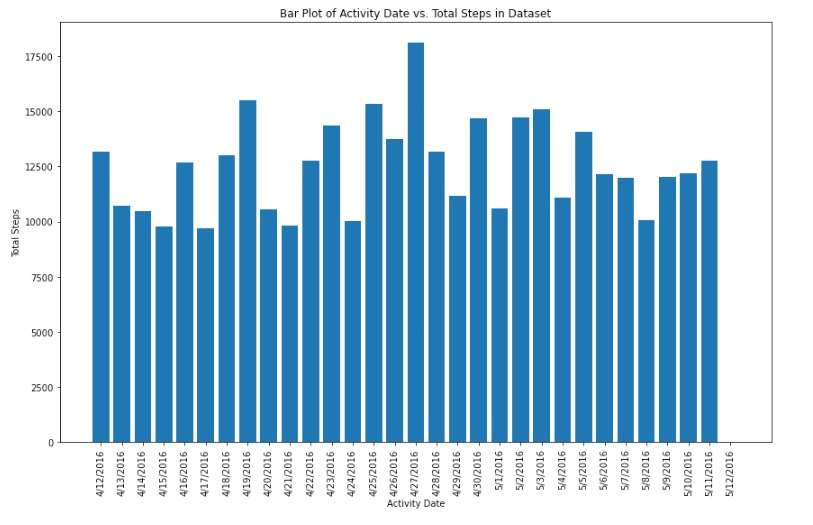
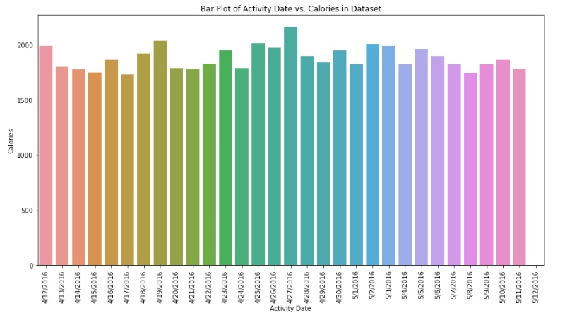
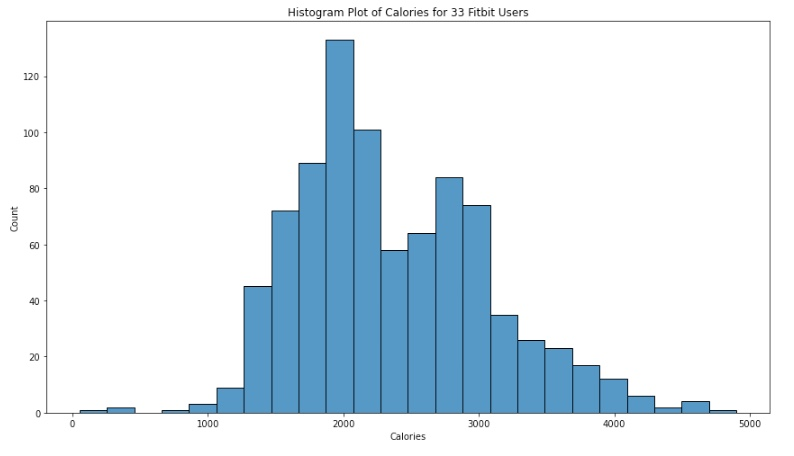

### Project Title

Creation of Machine Learning models that can be used to predict weight loss using exercise and dietary information for use by stakeholders that want to understand the features that are key for weight loss.

**Author**

Yemi Falokun

#### Executive summary

Machine learning (ML) is a branch of Artificial Antelligence (AI) that enables computers to “self-learn” from training data and improve over time, without being explicitly programmed. This can be used to predict weight loss, as people who lose weight tend to have certain patterns in their behavior. For example, they may eat less, exercise more, or change their diet. By analyzing data from people who have lost weight, machine learning algorithms can identify these patterns and use them to predict whether or not someone will be successful in their weight loss efforts.

This technology has the potential to revolutionize the way we think about weight loss. Instead of relying on traditional methods like dieting and exercise, we may be able to use machine learning to create personalized weight loss plans that are more likely to be successful.

#### TL;DR
This project provides information on ML/AI applications that were used to predict calories loss/weight loss. A summary presentation report is provided below:

- [Capstone Project - Report and Presentation - Predicting Weight Loss](https://github.com/yemifalokun/predicting-weight-loss/blob/main/presentation/Capstone-Project-Report-and-Presentation.pdf)

#### Rationale
Weight loss is a difficult and often frustrating process, but it can be life-changing. Here are just a few reasons why anyone should care about weight loss:

- Weight loss can improve your health, extra weight puts a strain on your heart, lungs, and joint and losing this weight can help to reduce your risk of developing health problems like heart disease, stroke, and type 2 diabetes
- Weight loss can improve your self-esteem, the extra weight can make people feel self-conscious and uncomfortable in your own skin. Losing weight can help you to feel more confident and comfortable in your own body
- Weight loss can improve your life expectancy. Carrying around extra weight can shorten your lifespan. Losing weight can help you to live a longer, healthier life

#### Research Question
There are many different research questions that could be asked about weight loss. Some examples include:
- What are the exercises that has the most impact on weight loss
- Does diet have a positive impact on weight loss
- With the dataset available, does Age, weight and gender have an impact on weight loss 

#### Data Sources
The following datasets will be used for this project:

- Fitbit weight data loss dataset from https://www.kaggle.com/datasets/arashnic/fitbit

#### Methodology
The following Machine Learning models will be used:
- Linear regression is a statistical method that can be used to understand the relationship between variables that contribute to weight loss, the variables would be exercise and weight loss
- Decision tree is another model that will be used to predict weight loss. It does this by creating a series of if-then statements that are based on the data. For example, if someone eats less or exercises more, then they are more likely to lose weight
- Compare results of Classifiers like K Nearest Neighbors (KNN), Logistic Regression, Support Vector  Machines (SVC) on the dataset to determine the model with greatest accuracy

#### Results

##### <ins> Data Visualization </ins>

As mentioned above, in exploring the dataset, a number of visualization was created to understand the distribution of weight loss information in the dataset. An example is the chart below that shows the number of steps taken by a Fitbit user during the period of 4/12/2016 to 5/12/2016.

The average number of steps for this user is approximately 12,000 and supports the average Calories recorded below.

With the average number of steps above, how does this translates to average number of calories. The chart below shows the number of calories lost by this user over the same period of 4/12/2016 to 5/12/2016.

This User is a fairly active users over the number of days in the dataset with average of 1816 calories over the number of days above

Finally, a visualization of the final data used to create the ML applications looking at the count of the Calories lost by all 33 Fitbit users.

The chart shows that largest amount of Calories lost recorded by users at 2,000, a fair distribution of calories lost data from 1,400 to 4,000 which means the ML Application would probably make better predictions for users that have recorded their number of steps and other variables in the data against these calories.

##### <ins> AI Application/Solutions </ins>

Three ML Applications were created, links to the corresponding notebooks are in [Outline of project](#Outline-of-project). These Applications provided the following results

###### <ins> Training Score Definition </ins>

- Training score is a measure of how well a model performs on the training data. The training score is calculated by taking the accuracy of the model on the training data. Accuracy is the percentage of predictions that are correct.
- High training score indicates that the model is learning well and is likely to perform well on the test data. A low training score indicates that the model is not learning well and is likely to perform poorly on the test data.

###### <ins> Test Score Definition </ins>

- Test score is a measure of how well a model performs on data that it has not seen before. It is important to test a model on new data to see how well it will generalize to new situations. 
- High test score indicates that the model is likely to perform well on new data, while a low test score indicates that the model may not perform as well.

##### <ins> AI Application 1 - ML Regressors </ins>

Regressors are a type of ML algorithms that can be used to predict a continuos value. The do this by learning from data (i.e., number of steps taken, total distance etc.) and then using that data to create a model that can make predictions about new data (i.e., number of calories lost)

The application uses variables like Total Distance and No of Steps taken to predict number of calories that a user could lose.

`Algorithm`: GradientBoostingRegressor

|        	|                    | 
|-------------------	|:---------------------------	|
| Training Score    | 85%                     |  
| Test Score         | 61%                       |  
|                       |                               |

This algorithm can predict calories loss with an accuracy of over 60%+

##### <ins> AI Application 2 - Decision Tree Classifier (DTC) </ins>

DTC is a ML model   that can be used to classify data. It does this by building tree of decisions based on the value of a variable (I.e., no of steps etc.).  

The tree is then used to classify new data like weight loss flag 

`Algorithm`: DecisionTreeClassifier

|        	|                    | 
|-------------------	|:---------------------------	|
| Training Score    | 62%                     |  
| Test Score        | 63%                       |  
|                       |                               |

This algorithm can predict weight loss with an accuracy of over 60%+

##### <ins> AI Application 3 - ML Classifications  </ins>

ML Classifications uses a process of dividing data into groups based on shared characteristics.  

The goal of classification is to identify patterns (i.e., no of steps taken etc.) in the data and use those patterns to predict the class of new data points (i.e., weight loss)

`Algorithm`: K-Nearest Neighbor (KNN)

|        	|                    | 
|-------------------	|:---------------------------	|
| Training Score    | 75%                     |  
| Test Score        | 59%                       |  
|                       |                               |

This algorithm can predict weight loss with an accuracy of over 60%+

### `Recommendation` - Use GradientBoostingRegressor algorithm with a  training score of 86% and testing score of 61%

##### <ins> Important Findings  </ins>

Three notebooks are included in this project which demonstrates that a number of Machine Learning (ML) models can be used to predict the number of calories loss and whether a person can lose weight.

The models used data from 33 Fitbit users over a period of a month. The model prediction provided training accuracy of 65% to 100% depending on the ML algorithms. Predict weight loss and number of calories lost with an accuracy of 65% to 100%. These ML algorithms will be deployed to create the AI applications with endpoints that users can call with input variables (i.e., number of steps, total distance etc.) and the applications will return number of predicted calories loss or a weight loss flag.

Each notebook includes a Findings section for the models, but a summary is as follows:
- For AI application 1, we tried a number of models with all the variables and a couple of strong inputs (i.e., Total Steps and Total Distance) . The model provided an accuracy score of 62% to 100% for training and 37% to 67% for test. Important Variables were Total Steps and Total Distance
- For AI application 2, the models produced an average accuracy score is in the 60% range
- For AI application 3, the K-Nearest Neighbor (KNN) had the best training score of 75% and test score of 58%

#### Outline of project
- [Notebook 1 - predicting-weight-loss-notebook1-linear-regression](https://github.com/yemifalokun/predicting-weight-loss/blob/main/notebooks/predicting-weight-loss-notebook1-linear-regression.ipynb)

- [Notebook 2 - predicting-weight-loss-notebook2-decision-tree-classifier](https://github.com/yemifalokun/predicting-weight-loss/blob/main/notebooks/predicting-weight-loss-notebook2-decision-tree.ipynb)

- [Notebook 3 -predicting-weight-loss-notebook3-comparing-classifiers](https://github.com/yemifalokun/predicting-weight-loss/blob/main/notebooks/predicting-weight-loss-notebook3-comparing-classifiers.ipynb)

#### Next Steps & Recommendations  

The recommendation would be to use an AI application with GradientBoostingRegressor algorithm (i.e., AI Application 1) with a training score of 86% and testing score of 61%. This provides room for training with more data especially data with users with steps over 30k steps and distances over 5 miles.

For Next steps based on the room to improve the models, I would recommend collecting more data where users record the following:
- Daily water consumption
- Calories intake (i.e., Protein, Carbs etc.)
- User demographics (i.e., Age, Gender, Weight etc.)

This would be used to train the model to provide better predictions for users based on some of the features listed above (i.e., daily water consumption etc.)

This ML model would be deployed as an AI application and Weight loss applications can use the model for users to determine what they need to do to lose weight or estimate the amount of Calories loss based on the variables used to build the model. 

  

#### Contact and Further Information 

  

`Author` - Yemi Falokun 

`Email` - yemifalokun@hotmail.com 

## License

Open source projects are made available and contributed to under licenses that include terms that, for the protection of contributors, make clear that the projects are offered “as-is”, without warranty, and disclaiming liability for damages resulting from using the projects.