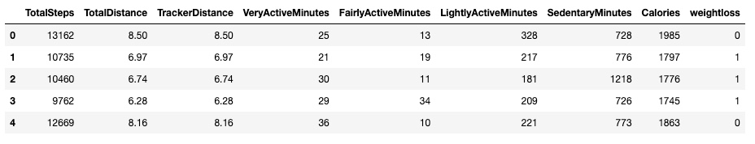
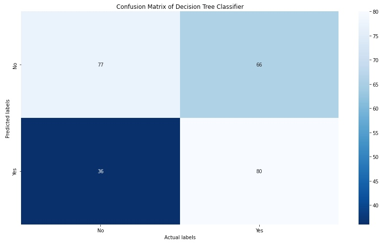
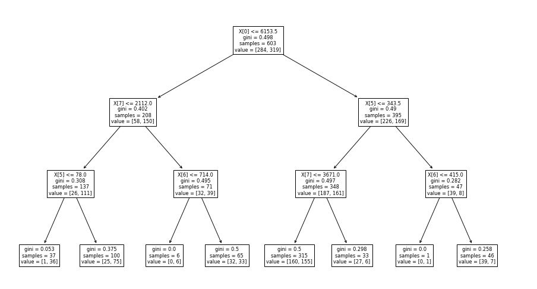

### Project Title

Creation of Machine Learning models that can be used to predict weight loss using exercise and dietary information for use by stakeholders that want to understand the features that are key for weight loss.

**Author**

Yemi Falokun

#### Executive summary

Machine learning (ML) is a branch of artificial intelligence (AI) that enables computers to “self-learn” from training data and improve over time, without being explicitly programmed. This can be used to predict weight loss, as people who lose weight tend to have certain patterns in their behavior. For example, they may eat less, exercise more, or change their diet. By analyzing data from people who have lost weight, machine learning algorithms can identify these patterns and use them to predict whether or not someone will be successful in their weight loss efforts.

This technology has the potential to revolutionize the way we think about weight loss. Instead of relying on traditional methods like dieting and exercise, we may be able to use machine learning to create personalized weight loss plans that are more likely to be successful.

#### Rationale
Weight loss is a difficult and often frustrating process, but it can be life-changing. Here are just a few reasons why anyone should care about weight loss:

- Weight loss can improve your health, extra weight puts a strain on your heart, lungs, and joint and losing this weight can help to reduce your risk of developing health problems like heart disease, stroke, and type 2 diabetes
- Weight loss can improve your self-esteem, the extra weight can make people feel self-conscious and uncomfortable in your own skin. Losing weight can help you to feel more confident and comfortable in your own body
- Weight loss can improve your life expectancy. Carrying around extra weight can shorten your lifespan. Losing weight can help you to live a longer, healthier life

#### Research Question
There are many different research questions that could be asked about weight loss. Some examples include:
- What are the exercises that has the most impact on weight loss
- Does diet have a positive impact on weight loss
- With the dataset available, does Age, weight and gender have an impact on weight loss 

#### Data Sources
The following datasets will be used for this project:

- Fitbit weight data loss dataset from https://www.kaggle.com/datasets/arashnic/fitbit
- Weight data loss dataset from https://www.kaggle.com/datasets/tombenny/foodhabbits

#### Methodology
The following Machine Learning models will be used:
- Linear regression is a statistical method that can be used to understand the relationship between variables that contribute to weight loss, the variables would be exercise and weight loss
- Decision tree is another model that will be used to predict weight loss. It does this by creating a series of if-then statements that are based on the data. For example, if someone eats less or exercises more, then they are more likely to lose weight
- Compare results of Classifiers like K Nearest Neighbors (KNN), Logistic Regression, Support Vector  Machines (SVC) on the dataset to determine the model with greatest accuracy

#### Results

This project uses the ML skills acquired during this course to build ML models predicting Calories burnt or weight loss using data from exercise by Fitbit users and Dietary information provided by users.

As described above in [Data Sources](#data-sources), I examine a couple of datasources. The [foodDiet.csv](https://github.com/yemifalokun/predicting-weight-loss/blob/main/data/foodDiet.csv) which includes 78 records with 7 features was used to build a Linear Regression ML model in the [predicting-weight-loss-using-diet-data-Linear-Regression.ipynb](https://github.com/yemifalokun/predicting-weight-loss/blob/main/notebooks/predicting-weight-loss-using-diet-data-Linear-Regression.ipynb)

The training model accuracy from this modeling is 0.492845 which means that the model correctly classified 49.28% of the instances. For Testing model, the accuracy score of -0.774792 and a  Mean Absolute Error of 0.202576  which means that the model was able to correctly classify only 22.52% of the data.

| Metric       	| Values                   | 
|-------------------	|:---------------------------	|
| Training 𝑅2 Score     | 0.492845                      |  
| Training RMSE         | 0.206424                        |  
| Training MAE          | 0.148942                        |  
| Testing 𝑅2 Score      | -0.774793                         |  
| Testing RMSE          | 	0.266211                        |  
| Testing MAE           | 0.202576                         |  
|                       |                               |  

This may be due to the number of records and features of the dataset. Based on these results, the models listed in the [Methodology](#methodology) section will use the [dailyActivity_merged.csv](https://github.com/yemifalokun/predicting-weight-loss/blob/main/data/dailyActivity_merged.csv) dataset.

Results from the models are described below:

<ins>Notebook 1</ins>

This notebook creates a ML Application using Linear Regression to understand the relationship between the features in this dataset where `Calories` is the dependent feature. Training and Test data sets were created using a 70/30 split

Two models (ML Applications) were created:
- `Model` - created using features - TotalSteps,TotalDistance,TrackerDistance,VeryActiveMinutes,FairlyActiveMinutes,LightlyActiveMinutes,SedentaryMinutes and Calories as the dependent feature/outcome variable
- `Model1` - created using features TotalSteps and TotalDistance and Calories as the dependent feature/outcome variable

The results from the two models are as follows:

| Model Name/Metrics  | Training R2 Score | Train Accuracy | Training RMSE |  Training MAE	 | Testing R2 Score | Testing Accuracy | Testing RMSE |  Testing MAE	 | 
|-------------------|:-----------------	|:------------:	|:--------------:	| :--------------:	| :--------------:	| :--------------:	| :--------------:	| :--------------:	| 
| Model              | 0.623067           | 0.623067 | 446.263378       |  360.828569      | 0.540718       | 0.540718       | 432.217685      | 354.726341     | 
| Model1             | 0.485793           | 0.485793  | 521.228244      |  406.471450       | 0.410035       | 0.410035       | 489.864699       | 	384.462094      | 
|                  |                   |                 |                  	|               |               |                   |               |                   |

For each model applications (model and model1), we ran some tests using sample Fitbit user profiles with the following results:

| Model Name  	| Test Description                                                                     	| Predicted Used Car Price ($) 	|
|-------------	|:--------------------------------------------------------------------------------------	|:----------------------------:	|
| Model       	| Fitbit user walking 10k steps should record Calories burnt 	| 928.45237048                  	|
| Model       	| Fitbit user walking 15k steps should record Calories burnt       	| 1976.52850815                    	|
| Model      	| FitBit User walking 30k steps should record Calories burnt                                                               	| 1204.29072521                    	|
| Model1      	| Fitbit user walking 10k steps should record Calories burnt                                                        	| 1694.96658981                   	|
| Model1      	| Fitbit user walking 15k steps should record Calories burnt                                                          	| 2545.05292117                   	|
| Model1      	| Fitbit user walking 30k steps should record Calories burnt                                                           	| 1478.1901517                  	
|             	|                                                                                      	|                              	|

Predicted results from this model does not look realistic for the 30k test, you would expect that the more steps and distance that you walk should result in higher calories, but the inverse is the case looking at the test results above. The 30k prediction may be due to the dataset used to train the model as there was a limited amount of datasets where the number of steps taken was over 25,000.

<ins>Notebook 2</ins>

This notebook created some ML applications using the Decision Tree Classifier. For these models, the daily calories records by the user was used to create a `weightloss` feature which was set to `1 = Yes` or `0 = No`.
- Yes: if the previous calorie recorded was more than the next day
- No: if the previous calorie recorded was less than the next day

Using this dataset, setting the max_depth = 5 and using a Standard Scaler, the model provided the following results:

- Training Accuracy Score 0.694859
- Test Accuracy Score 0.606178
- Precision: 0.614681
- Recall: 0.614058
- F1-score: 0.606125

The confusion matrix that defines the performance of the classification algorithm is depicted below.

With the depth set to 5 and out of those 259 fitbit users, the model classifier predicted 116 times when the user will lose calories and No in 143 times. In reality, 146 fitbit users burnt calories and 113 fitbit users did not.

Treeplot of the Decision Tree Classifier with Max Depth set to 3

Using Grid Search to create models with the different parameters and evaluate the performance metrics

| Model Name        	| Train Time (s)                      | Best Parameters                                          | Best Score 	                | 
|-------------------	|:---------------------------	|:-------------------------------------------------:	         |:----------------------:	|
| Decision Tree Classifier - Model 1   | 1.340982	    | {'model__criterion': 'gini', 'model__max_depth': 1, 'model__min_samples_leaf': 1}                     | 0.593852             |  
| Decision Tree Classifier - Model 2   | 4.991964       | {'model__ccp_alpha': 0.01, 'model__criterion': 'entropy', 'model__max_depth': 5, 'model__max_features': 'sqrt'} | 0.625109                |  
|                       |                               |                                                                |                        	| 

Decision Tree Classifier - Model 2 performed better with additional parameters like ccp_alpha and max_features.

<ins>Notebook 3</ins>

For this notebook, we compared the training time and accuracy of the following models on the Fitbit Data sets.

- Logistic Regression
- K Nearest Neighbors (KNN)
- Support Vector Machines (SVC)

The comparison was done using default parameters for these classifiers and specifying a range of paramaters with Grid Search Cross Validation.

##### Default Parameters Results

| Model Name        	| Train Time (ms)                      | Train Accuracy                | Test Accuracy 	                | 
|-------------------	|:---------------------------	|:---------------------:	|:----------------------:	|
| Logistic Regression   | 24                       | 0.664093        | 0.0.630182                 |  
| KNN                   | 43.6                         | 0.754561        | 0.0.586873                  |  
| SVM                   | 74                         | 0.673300       | 0.0.613900                 |  
|                       |                               |                           |                        	| 

KNN had the best training score and Logistic Regression had the best Test Accuracy. Logistic Regression was the fastest model to train.

##### GridSerachCV Parameters Results

Using Grid Search to create models with the different parameters and evaluate the performance metrics

| Model Name        	| Train Time (s)                      | Best Parameters                                          | Best Score 	                | 
|-------------------	|:---------------------------	|:-------------------------------------------------:	         |:----------------------:	|
| Logistic Regression   | 7.842295                            | {'model__C': 1.0, 'model__penalty': 'l2', 'model__solver': 'liblinear'}	                     | 0.627077              |  
| KNN                   | 0.684460                           | {'model__n_neighbors': 17}	                                               | 0.640383                |  
| SVM   | 324.259399	                           | {'model__C': 1.0, 'model__gamma': 0.5, 'model__kernel': 'rbf'}                                         | 0.656749               |  
|                       |                               |                                                                |                        	| 

SVM had the best score followed by KNN and SVM took the longest time to train, KNN was the fastest.

#### Outline of project
- [Notebook 1 - predicting-weight-loss-notebook1-linear-regression](https://github.com/yemifalokun/predicting-weight-loss/blob/main/notebooks/predicting-weight-loss-notebook1-linear-regression.ipynb)

- [Notebook 2 - predicting-weight-loss-notebook2-decision-tree-classifier](https://github.com/yemifalokun/predicting-weight-loss/blob/main/notebooks/predicting-weight-loss-notebook2-decision-tree.ipynb)

- [Notebook 3 -predicting-weight-loss-notebook3-comparing-classifiers](https://github.com/yemifalokun/predicting-weight-loss/blob/main/notebooks/predicting-weight-loss-notebook3-comparing-classifiers.ipynb)

##### Contact and Further Information